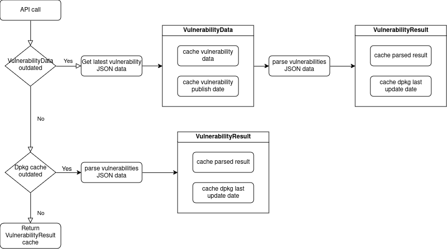

# How caching works for vulnerability commands

For the vulnerability commands (both API and CLI commands), we use caching to speed up
the commands on subsequent runs. We cache both our vulnerability JSON data and the
parsed result of that vulnerability data. To support that, we have four distinct caches:

* **data cache**: This is just raw JSON vulnerability data.
* **published data cached**: This caches the publish date of the vulnerability data.
  We use it to check if there is new version of the JSON data available.
* **result cache**: This is the JSON data created by parsing the JSON vulnerability data in the
  system.
* **dpkg status cache**: This caches the `mtime` of **/var/lib/dpkg/status**. We use this cache to
  verify if our result cache is stale. The reason is that any APT related changes should invalidate
  the result cache.

Given all that, the following data flow diagram provides a better visualization of the role of those
caches when running a vulnerability API command:

## Are there situations when the caches are not produced ?

There are other scenarios where we don't cache anything when running the commands.
That will happen when the user:

* Provides a manifest file for the vulnerability commands
* Provides a static vulnerability JSON data for the vulnerability commands

