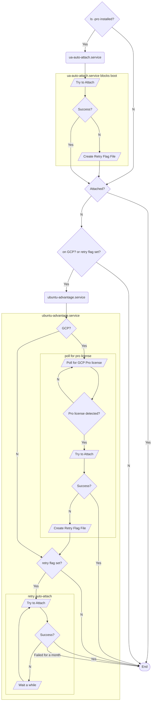

# Mechanisms for auto-attaching Ubuntu Pro Cloud instances

> **Note**
> This document explains the systemd units that attempt to auto-attach in various scenarios. If you're interested in how auto-attach itself works, see [How auto-attach works](./how_auto_attach_works.md).

There are three methods by which a cloud instance may auto-attach to become Ubuntu Pro.

1. On boot auto-attach for known Pro cloud instances.
2. Upgrade-in-place for non-Pro instances that get modified via the Cloud platform to entitle them to become Ubuntu Pro (only on GCP for now)
3. Retry auto-attach in case of failures

(1) is handled by a systemd unit (`ua-auto-attach.service`) delivered by a separate package called `ubuntu-advantage-pro`. This package is only installed on Ubuntu Pro Cloud images. In this way, an instance launched from an Ubuntu Pro Cloud image knows that it needs to auto-attach.

(2) and (3) are both handled in a systemd unit (`ubuntu-advantage.service`) that is present on all Ubuntu machines (including non-Pro).

Below is a flow chart intended to describe how all of these methods and systemd units interact.

