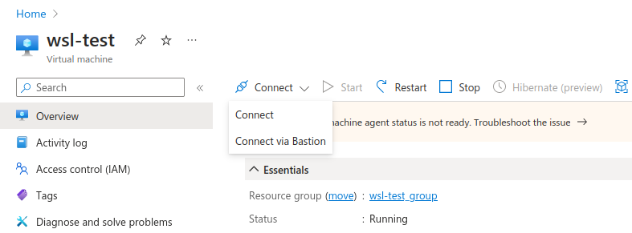

# How to set up a Windows machine for WSL testing

To run our integration tests on Windows Subsystem for Linux (WSL) instances, we need to first set up
a Windows machine that will allow us to launch the WSL instances. After that, we also need to set up
an OpenSSH server so we can run SSH commands on the Windows machine.

This guide presents all the necessary steps for the set up, from launching the Windows 11 Pro
image in Azure to testing if WSL is correctly working on the machine.

## Launching the image on Azure

When launching the Windows instance on Azure, we need to perform some
configuration to be able to launch WSL instances.

First of all, name the machine as `wsl-test`. Currently, this is the name we expect on the
integration tests.

After that, select the `Windows 11` image and mark the `Security Type` as *Standard*.


The alternative "Trusted Launch" [doesn't support Nested Virtualization](https://learn.microsoft.com/en-us/azure/virtual-machines/trusted-launch#unsupported-features),
required to run WSL.

For the administrator account, mark the `Authentication Type` as *Password*,
and set the `Username` to *ubuntu*. 
We will use this account setting to manually log into the machine to run some commands there directly.


Select the SSH inbound port for the machine.


Finally, you will need to check this checkbox here:  


We have already confirmed with the WSL team that our Azure accounts have the proper license to
launch the Windows machine.


## Configure Bastion to log into the machine

To log into the machine and access its GUI, you need to set up Bastion.
After launching the machine, go for the *Connect via Bastion* option:




After deploying the Bastion, you just need to present your username and password to log into the
machine.

## Configuring Hyper-V

After logging into the machine through Bastion, you need to configure Hyper-V by following
this [tutorial](https://learn.microsoft.com/en-us/azure/lab-services/how-to-enable-nested-virtualization-template-vm-using-script?tabs=powershell)

## Installing winget

Each WSL Ubuntu distro has a dedicated installer in the Microsoft store. Therefore, before launching
any WSL instance, we need to install the installers first. To achieve that, we need to configure
**winget**.

To install it on the machine, follow this [tutorial](https://winget.pro/winget-install-powershell/)

```
Note that you can paste the commands in Bastion by using the clipboard feature that can be found
under this arrow:
```

 

```
Finally, if you see the following error during installation, restart the machine first:

Add-AppxPackage : Deployment failed with HRESULT: 0x80073D02, The package could not be installed
because resources it modifies are currently in use. 
```

## Installing WSL

To install WSL, just run the following command, as an administrator, on powershell:

```console
$ wsl --install
```

After that, we need to update WSL to the pre-release version by running:

```console
$ wsl --update --pre-release
```


```{note}
We are installing the pre-release version because it allows us to directly run wsl commands
through SSH. Once that fix is officially released, we will no longer need to install the
pre-release version.
```

Now, install a Bionic instance to test the whole WSL set up is working as expected:

```console
$ winget install --name "Ubuntu 18.04 LTS" --accept-source-agreements --accept-package-agreements --silent
```

Now, create the instance with:

```console
$ & ubuntu1804.exe install --root
```

After that, just test to see if we can run commands on the WSL instance:

```console
$ wsl -d Ubuntu-18.04 --exec lsb_release -a
```

## Installing OpenSSH server

To install OpenSSH server, follow these steps:

1) Open *Settings*
2) Go to *System*
3) Go to *Optional Features*
4) Go to *Add an optional feature*
5) Search for *ssh*
6) Install OpenSSH Server

After installing the Service, open PowerShell and launch it by running:

```console
$ Start-Service sshd
```

And set it to automatically start after boot:

```console
$ Set-Service -Name sshd -StartupType 'Automatic'
```

### Configure the SSH keys

We need to add a SSH public key into the Windows machine.

To do that, follow these steps:

1) Create a public key to be used in the Windows machine (You can also reuse an existing key if you want to)

2) Set the **UACLIENT_BEHAVE_WSL_IP_ADDRESS** environment variable with the Windows machine IP address. 
This variable will be used in the integration test, but we will already use it in one of the
following steps.

2) Send the public key to the Windows machine:

```console
$ scp PUB_KEY_PATH ubuntu@$UACLIENT_BEHAVE_WSL_IP_ADDRESS:C:\\ProgramData\\ssh
```

3) SSH into the Windows machine. Note that this SSH will ask you for the password you have set up during the Windows image creation.
4) Run the following commands:

```console
$ cd %programdata%/ssh
```

```console
$ type PUB_KEY_NAME >> administrators_authorized_keys
```

```console
$ icacls administrators_authorized_keys /inheritance:r /grant "Administrators:F" /grant "SYSTEM:F"
```

Now test SSH into the machine using your private key

## Configure the machine for automatic login

To properly run **winget** commands after a machine reboot, a user
needs to be already logged into the machine. To automate that process,
follow this [tutorial](https://learn.microsoft.com/en-us/troubleshoot/windows-server/user-profiles-and-logon/turn-on-automatic-logon#use-registry-editor-to-turn-on-automatic-logon)

Note that you also need to manually create the **DefaultUserName** and **DefaultPassword** files.

## Running the integration test

After this set up, you should be able to use that machine to run the WSL tests automatically.
Before running a WSL test, remember to set the following environment variables:

* **UACLIENT_BEHAVE_WSL_IP_ADDRESS**
* **UACLIENT_BEHAVE_WSL_PRIVKEY_PATH**
* **UACLIENT_BEHAVE_WSL_PUBKEY_PATH**

Note that this variables must be set on our local machine. The integration test setup will use them
to stablish the connection with the Windows host machine to create the WSL instances the tests will
run on.

