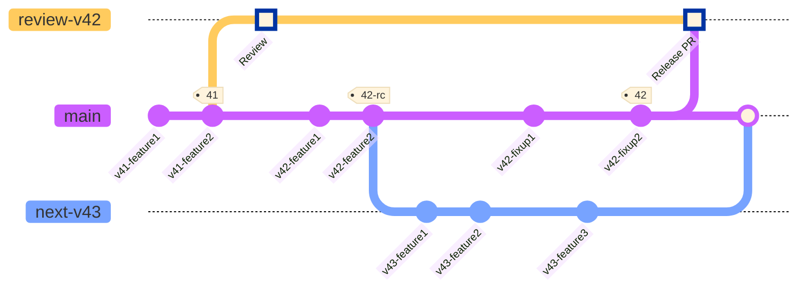

# Ubuntu Pro Client full release process

## Background

The release process for ubuntu-advantage-tools has three overarching steps/goals.

1. Release to our team infrastructure. This includes GitHub and the `ua-client` PPAs.
2. Release to the latest Ubuntu devel release.
3. Release to the supported Ubuntu past releases via [SRU](https://wiki.ubuntu.com/StableReleaseUpdates) using the [ubuntu-advantage-tools specific SRU process](https://wiki.ubuntu.com/UbuntuAdvantageToolsUpdates).

Generally speaking, these steps happen in order, but there is some overlap. Also we may backtrack if issues are found part way through the process.

Releases are scheduled to take 6 weeks, following the schedule below:
- Week 1
  - A Pro Client maintainer sets up the new version
  - Sponsor from Canonical Server team reviews
- Weeks 2 and 3: SRU review ending in upload to `-devel` and `-proposed` at the same time
- Week 4: Sit in `-proposed` for 7 days. Verification happens during this time.
- Weeks 5 and 6: These weeks are allocated as a buffer in case any of the previous steps take longer than expected
- After week 6: Release to `-updates`

> **Note**
> In practice, the Sponsor and SRU reviews tend to overlap during the first three weeks.

> **Warning**
> If the release contains any change listed in the [Early Review Sign-Off list](../references/early_review_signoff.md), make sure it was properly reviewed *before* starting the release process. Ideally they would be reviewed even before implementation, but if some feature is in the list and didn't get a proper review, now is the time to do so.

### Prerequisites

If this is your first time releasing ubuntu-advantage-tools, you'll need to do the following before getting started:

* Add the team helper scripts to your PATH: [uss-tableflip](https://github.com/canonical/uss-tableflip).
* If you don't yet have a gpg key set up, follow the instructions
  [here](https://help.launchpad.net/YourAccount/ImportingYourPGPKey) to create a key,
  publish it to `hkp://keyserver.ubuntu.com`, and import it into Launchpad.
* Before you run `sbuild-it` for the first time, you'll need to set up a chroot for each Ubuntu release.
  Run the following to set up chroots with dependencies pre-installed for each release:
  ```bash
  apt-get install sbuild-launchpad-chroot
  # do this for each supported release, e.g. xenial, bionic, focal, jammy, noble, etc.
  sbuild-launchpad-chroot create -d $release -a amd64 -n $release-amd64
  ```
  
* In order to run the `ppa` command, install `ppa-dev-tools` from `bryce`'s PPA:
  ```bash
  sudo add-apt-repository ppa:bryce/ppa-dev-tools
  sudo apt update
  sudo apt install ppa-dev-tools
  ```
  When running `ppa` for the first time, there will be another round of launchpad authorization to be performed.

### Git branch release strategy overview

This diagram presents the branches that happen during the process of releasing version 42.

<!--
NOTE: There are fake commits ("Review" and "Release PR") in the mermaid definition to get it to display the review branch in the diagram, but they don't actually get created in a real release.
-->


`main` is the only long-lived branch.

When we reach a point in `main` where we are ready to release version 42, we do the following:
* Tag that commit as `42-rc`
* Create a branch called `review-v42` from the `41` tag
  * This branch does not have any new commits on it, it is only used as a target for the PR that will be created in the next step
* Create a draft PR in GitHub from `main` targeting `review-v42`
* Create a branch called `next-v43` from the `42-rc` tag
* For any open PRs that are not to be included in version 42, change their target to `next-v43`
  * Any new PRs for ongoing development during the version 42 release process must target `next-v43`
* Sponsor and SRU review uses the `main`->`review-v42` PR
  * Feedback that requires changes are added to `main`
* When version 42 is approved, the tip of `main` is tagged `42` and the Sponsor uploads using that commit
  * The `review-v42` branch is now deleted along with the `main`->`review-v42` PR (the PR is not merged).
* After version 42 is released, `next-v43` is rebased on top of `main` and `next-v43` is deleted
* Development continues on `main` until we are ready to begin releasing version 43

## Release process

The process will use `$version` throughout in place of the version number, e.g., `42`. The process will also use `$devel_release` in place of the current devel release, e.g., `noble`.

### 1. Set up `review` and `next` branches

```bash
# Make sure you are up to date
git switch main
git pull

# Tag the release candidate
git tag $version-rc # e.g., 42-rc
git push origin $version-rc

# Create the next branch
git switch -c next-v$((version+1))
git push origin next-v$((version+1))

# Create the review branch
git switch main
git switch -c review-v$version
git push origin review-v$version
```

Now configure two things:
1. Change GitHub's "default" branch to `next-v$((version+1))`
    - This should automatically switch any open PRs against `main` to target `next-v$((version+1))`.
2. Change the daily PPA build recipe to use `next-v$((version+1))`

And finally, create a draft PR from `main` to `review-v$version` on GitHub.

### 2. Write a changelog entry

Create a PR against `main` finishing the changelog entry for the new version. In the top entry, change `1:1+devel` to `$version` and change `UNRELEASED` to `$devel_release`. Also review the contents of the changelog entry and add anything that is missing. This PR should be reviewed and merged before starting the release process.

You don't need to include a note for all of the commits included in the release. Remember that the changelog should be read by the user to understand the new features/modifications in the package. If you think a commit will not add that much to the user experience, you can drop it from the changelog.

To structure the changelog you can use the other entries as example. But we basically try to keep this order: Debian changes; new features/modifications; testing. Within each section, bullet points should be alphabetised.

When reviewing the release PR, please use the following guidelines when reviewing the new changelog entry:
  * Is the version correctly updated? We must ensure that the new version in the changelog is
    correct and it also targets the latest Ubuntu release at the moment.
  * Is the entry useful for the user? The changelog entries should be user focused, meaning
    that we should only add entries that we think users will care about (i.e. we don't need
    entries when fixing a test, as this doesn't provide meaningful information to the user).
  * Is this entry redundant? Sometimes we may have changes that affect separate modules of the
    code. We should have an entry only for the module that was most affected by it.
  * Is the changelog entry unique? We need to verify that the changelog entry is not already
    reflected in an earlier version of the changelog. If it is, we need to not only remove but also to double
    check the process we are using to cherry-pick the commits.
  * Is this entry actually reflected in the code? Sometimes, we can have changelog entries
    that are not reflected in the code anymore. This can happen during development when we are
    still unsure about the behaviour of a feature or when we fix a bug that removes the code
    that was added. We must verify each changelog entry that is added to be sure of their
    presence in the product.

### 3. Release to our staging PPA

1. Clone the repository into a clean directory and `git checkout $version`.
    * *WARNING* Build the package in a clean environment, because the package
    will contain everything that is present in the folder. If you are storing credentials or
    other sensible development information in your folder, they will be uploaded too when we send
    the package to the PPA. A clean environment is the safest way to perform this.

2. Edit the changelog
  * List yourself as the author of this release.
  * Edit the version number to look like: `$version~rc1` (`<version>~rc<release-candidate-number>`)
  * Edit the Ubuntu release name. Start with the `ubuntu/devel` release.
  * `git add debian/changelog && git commit -m "throwaway"` - Do **not** push this commit!

3. Run `build-package`
  * This script will generate all the package artifacts in the parent directory as `../out`.

4. Run `sbuild-it ../out/<package_name>.dsc`
  * If this succeeds move on. If this fails, debug and fix before continuing.

5. Repeat steps 2 through 4 for all supported Ubuntu releases
  * The version for series other than `devel` should be in the form `<version>~<ubuntu-release-number>~rc<release-candidate-number>`
  This means you must add the release number in the changelog. For example, suppose
  the devel version is `1.1~rc1`. If you want to build for Jammy now, change it to
  `1.1~22.04~rc1`.

6. For each release, `dput` to the staging PPA:
  * `dput ppa:ua-client/staging ../out/<package_name>_source.changes`
  * After each `dput` wait for the "Accepted" email from Launchpad before moving on.

### 4. Release to Ubuntu (devel and SRU)

1. Prepare SRU Launchpad bugs.
    * We do this even before a successful merge into `ubuntu/devel` because the context added to these bugs is useful for the Server Team reviewer.

    * Create a new bug on Launchpad for ubuntu-advantage-tools and use the format defined [here](https://wiki.ubuntu.com/UbuntuAdvantageToolsUpdates#SRU_Template) for the description.
      * The title should be in the format `[SRU] ubuntu-advantage-tools (27.1 -> 27.2) Xenial, Bionic, Focal, Jammy`, substituting version numbers and release names as necessary.
      * If any of the changes for the SRU is in the [Early Review Sign-off list](../references/early_review_signoff.md), include a pointer in the `[Discussion]` section to where the discussion/approval of that feature took place (if possible).

    * For each Launchpad bug fixed by this release (which should all be referenced in our changelog), add the SRU template to the description and fill out each section.
      * Leave the original description in the bug at the bottom under the header `[Original Description]`.
      * For the testing steps, include steps to reproduce the bug. Then include instructions for adding `ppa:ua-client/staging`, and steps to verify the bug is no longer present. Mention that the staging PPA will be replaced with `-proposed` for actual verification.

2. Ask for Sponsor and SRU review of the Release PR
    * The description of the PR should follow this format:
    ```
    # Review Release 31

    * **Pro Client Representative:** @<your github username>
    * **Sponsor Reviewer:** @<sponsor github username>
    * **SRU Reviewer:** @<sru reviewer github username>

    ## Notes

    * If there is anything particularly interesting about this PR that a reviewer may want to know, put it here.
    ```
    * Add links to the `autopkgtest` triggers for the staging PPA to the PR. The reviewer will have permission to trigger those tests. The links can be obtained by running `ppa tests -r <release> -a <arch1,arch2> ua-client/staging -L`
      * Make sure to post links to all the architectures built for a given release.
      * The riscv64 autopkgtests are not avaialble and don't need to be included.
      * The `ppa test` command will have two variations of tests: the regular one, and one with `all-proposed=1`; only the regular test need to be there.
    * Mark the Sponsor and SRU reviewers as "Reviewers" on the PR.
    * Mark yourself as "Assigned" to the PR.
    * Tag the reviewers in MatterMost to let them know the PR is ready for review. Remind the Sponsor that it is their turn to review and that the SRU review will happen as soon as the Sponsor is happy.

3. Address review feedback
    * When any reviewer requests changes, create a PR against `main` with the changes and ask for review. Merging that PR will automatically bring the changes into the Release Review PR.
      * Some issues may just be filed for addressing in the future if they are not urgent or pertinent to this release.
      * Unless the changes are very minor, or only testing related, you should upload a new release candidate version to `ppa:ua-client/staging` as described in I.3.
    * Once Sponsor review is complete and approved, the Sponsor should **not** upload the version to the `devel` release.
      * If they do, then any changes to the code after this point will require a bump in the patch version of the release.
    * When the Sponsor is happy, tag the SRU reviewer again and let them know it is their turn to review. Follow the same process for addressing feedback from the SRU reviewer.


4. Approval and upload to `devel` and `-proposed` unapproved queue
    * Once the SRU team member gives a pre-SRU approval, create backport branches for each stable release. They should be named `release-$version-$release`.
      * The only addition for each branch should be the changelog entry for the new version. The entry should be in the format
      ```
      ubuntu-advantage-tools (31.2~20.04) focal; urgency=medium

        * Backport new upstream release (LP: #SRUBUG)

      -- Grant Orndorff <grant.orndorff@canonical.com>  Thu, 29 Feb 2024 09:03:11 -0500
      ```
      * The versions for the stable releases must be in the format `$version~<release-number>`
    * Tell the Sponsor that the branches are ready for them to upload to `devel` and the SRU unapproved queue.
    * Check the [`-proposed` release queue](https://launchpad.net/ubuntu/xenial/+queue?queue_state=1&queue_text=ubuntu-advantage-tools) for presence of `ubuntu-advantage-tools` in unapproved state for each supported release. Note: Libera chat `#ubuntu-release` IRC channel has a bot that reports queued uploads of any package in a message like `"Unapproved: ubuntu-advantage-tools .. version"`.
    * Tell the SRU Reviewer that the packages are in the `-proposed` unapproved queue. They will need to actually approve the package to move into `-proposed`.

4. -proposed verification and release to -updates

    * As soon as the SRU vanguard approves the packages, a bot in `#ubuntu-release` will announce that `ubuntu-advantage-tools` is accepted into the applicable `-proposed` pockets, or the [Xenial `-proposed` release rejection queue](https://launchpad.net/ubuntu/xenial/+queue?queue_state=4&queue_text=ubuntu-advantage-tools) will contain a reason for rejection. Double check the SRU process bug for any actionable review feedback.
      * Once accepted into `-proposed` by an SRU vanguard [`ubuntu-advantage-tools` shows up in the `pending_sru` page](https://people.canonical.com/~ubuntu-archive/pending-sru.html), check `rmadison ubuntu-advantage-tools | grep -proposed` to see if the upload exists in `-proposed` yet.
      * Also actually check that the packages are accessible in a container by [enabling proposed](https://wiki.ubuntu.com/Testing/EnableProposed) and updating the package.


    * Perform the [Ubuntu-advantage-tools SRU verification steps](https://wiki.ubuntu.com/UbuntuAdvantageToolsUpdates). This typically involves running all behave targets with `-D install_from=proposed -D check_version=$version~$release_number` and saving the output.
      * There may also be one-time test scripts added in the `sru/` directory for this release.

    * After all tests have passed, tarball all of the output files and upload them to the SRU bug with a message that looks like this:

    ```
    We have run the full ubuntu-advantage-tools integration test suite against the version in -proposed. The results are attached. All tests passed.

    You can verify the correct version was used by checking the output of the first test in each file, which prints the version number.

    I am marking the verification done for this SRU.
    ```

    * Change the tags on the bug from `verification-needed` to `verification-done` (including the verification tags for each Ubuntu release).

    * For any other related Launchpad bugs that are fixed in this release, perform the verification steps necessary for those bugs and mark them `verification-done` as needed. This will likely involve following the test steps, but instead of adding the staging PPA, enabling `-proposed`.

    * Once all SRU bugs are tagged as `verification*-done`, all SRU-bugs should be listed as green in [the `pending_sru` page](https://people.canonical.com/~ubuntu-archive/pending-sru.html).

    * After the pending SRU page says that `ubuntu-advantage-tools` has been in `-proposed` for 7 days, it is now time to ping the SRU Reviewer for acceptance of `ubuntu-advantage-tools` into `-updates`.

    h. Check `rmadison ubuntu-advantage-tools` for updated version in `-updates`.
      * Also actually check that the packages are accessible in a container and updating the package.

### 5. Finalising the release and preparing for the next one

1. Tag the commit that got released as `$version`, this should be the tip of `main`.
    * `git tag $version`
    * `git push origin $version`
2. Close the release PR and delete the `review-v$version` branch.
3. Perform the steps from "Releasing to our staging PPA" above but use a `~stableppaX` suffix instead of `~rcX` in the version name, and upload to `ppa:ua-client/stable` instead of staging.
4. Release the documentation changes
    * Open a pull request merging the `docs-devel` branch to the `docs` branch. Ask in the `~Pro` channel for a review. Some conflicts may appear but those should be only content-related and easy enough to fix.
    * Once the pull request lands, the `latest` documentation will be automatically updated.
    * Tag the HEAD of the `docs` branch as `v<version>`. Example: `v28`.
      * The `v` in the tag differentiates the documentation releases as they will appear in Read the Docs from the software version tags in the `release` branch.
    * Go to [the project in Read the Docs](https://readthedocs.com/projects/canonical-ubuntu-pro-client/), go to the `Versions` tab, look for the tag in the "inactive versions" list and click `Activate`.
      * Be sure the `Active` checkbox is checked, and the privacy level is set to `Public`.
      * *If* there were any changes applied only to `docs`, open a pull request merging the `docs` branch back to `docs-devel`.
5. Rebase `next-v$((version+1))` on top of `main` and open a PR to merge it. Once it is merged, delete the `next-v$((version+1))` branch.
    * You will likely need to re-add the `1:1+devel UNRELEASED` changelog entry.
      ```
      dch --newversion "1:1+devel"
      sed -i 's/__VERSION__ = .*$/__VERSION__ = "1:1+devel"/' uaclient/version.py
      git add debian/changelog uaclient/version.py
      git commit -m "open next development version"
      ```
6. Change GitHub's "default" branch back to `main`.
    * This should automatically switch any open PRs against `next-v$((version+1))` to target `main`.
7. Change the daily PPA build recipe to use `main`.
8. Open a PR moving any scripts added in `sru/` to a new folder in `sru/_archive` for the release.
