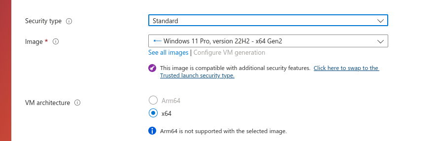

.. _wsl_testing_setup:

How to set up a Windows machine for WSL testing
***********************************************

To run our integration tests on Windows Subsystem for Linux (WSL) instances,
you need to first set up a Windows machine that will allow you to launch the
WSL instances. After that, you also need to set up an OpenSSH server so you can
run SSH commands on the Windows machine.

This guide presents all the necessary steps for the set up, from launching the
Windows 11 Pro image in Azure to testing if WSL is correctly working on the
machine.

Launching the image on Azure
============================

When launching the Windows instance on Azure, there are a few configurations
that need to be set, otherwise you will not be able to launch WSL instances.

First of all, name the machine as ``wsl-test``. Currently, this is the name we
expect on the integration tests.

After that, select the ``Windows 11`` image and mark the ``Security Type`` as
"Standard".

The alternative "Trusted Launch"
`doesn't support Nested Virtualisation <https://learn.microsoft.com/en-us/azure/virtual-machines/trusted-launch#unsupported-features>`_,
which is required to run WSL.

Set a username and password for the VM. Set the username to ``ubuntu``. You will
use this account setting to manually log into the machine to run some commands
there directly.

Next, select the SSH inbound port for the machine:

.. image:: windows-setup-port.png

Finally, you will need to check the "Licensing" checkbox to confirm you have a
valid license:

You have already confirmed with the WSL team that your Azure accounts have the
proper license to launch the Windows machine.

Configure Bastion to log into the machine
=========================================

To log into the machine and access its GUI, you need to set up Bastion.
After launching the machine, select the "Connect via Bastion" option:

.. image:: windows-bastion.png

After deploying the Bastion, you need to present your username and password to
log into the machine.

Configuring Hyper-V
===================

After logging into the machine through Bastion, you need to configure Hyper-V by
`following this tutorial <https://learn.microsoft.com/en-us/azure/lab-services/how-to-enable-nested-virtualization-template-vm-using-script?tabs=powershell>`_

Installing winget
=================

Each WSL Ubuntu distribution has a dedicated installer in the Microsoft store.
Therefore, before launching any WSL instance, you need to install the relevant
installer first. To achieve that, you need to configure ``winget``.

To install it on the machine, `follow this tutorial <https://winget.pro/winget-install-powershell/>`_.

.. note::
   You can paste the commands in Bastion by using the clipboard feature, which
   is expanded by selecting the double-arrow symbol:

   .. image:: windows-bastion-clipboard.png

   .. image:: windows-bastion-clipboard-paste.png

Finally, if you see the following error during installation:

.. code-block:: text

   Add-AppxPackage : Deployment failed with HRESULT: 0x80073D02, The package
   could not be installed because resources it modifies are currently in use. 

You will need to restart the machine first.

Installing WSL
==============

To install WSL, run the following command as an administrator on PowerShell:

.. code-block:: bash

   $ wsl --install

After that, you need to update WSL to the pre-release version by running:

.. code-block:: bash

   $ wsl --update --pre-release

.. note::
   You are installing the pre-release version because it allow us to directly
   run WSL commands through SSH. Once that feature is officially released, you
   will no longer need to install the pre-release version.

Now, install a Bionic instance to test the whole WSL set up works as expected:

.. code-block:: bash

   $ winget install --name "Ubuntu 18.04 LTS" --accept-source-agreements --accept-package-agreements --silent

Now, create the instance with:

.. code-block:: bash

   $ & ubuntu1804.exe install --root

After that, test to see if you can run commands on the WSL instance:

.. code-block:: bash

   $ wsl -d Ubuntu-18.04 --exec lsb_release -a

Installing OpenSSH server
=========================

To install OpenSSH server, follow these steps:

1) Open :guilabel:`Settings`
2) Go to :guilabel:`System`
3) Go to :guilabel:`Optional Features`
4) Go to :guilabel:`Add an optional feature`
5) Search for :guilabel:`ssh`
6) Install OpenSSH Server

After installing the Service, open PowerShell and launch it by running:

.. code-block:: bash

   $ Start-Service sshd

And set it to automatically start after boot:

.. code-block:: bash

   $ Set-Service -Name sshd -StartupType 'Automatic'

Configure the SSH keys
----------------------

You need to add an SSH public key to the Windows machine. To do that, follow
these steps:

1) Create a public key to be used in the Windows machine (you can also reuse an
   existing key if you want to).

2) Set the ``UACLIENT_BEHAVE_WSL_IP_ADDRESS`` environment variable with the
   Windows machine IP address. This variable will be used in the integration
   test, but you will already use it in one of the following steps.

3) Send the public key to the Windows machine:

   .. code-block:: bash

      $ scp PUB_KEY_PATH ubuntu@$UACLIENT_BEHAVE_WSL_IP_ADDRESS:C:\\ProgramData\\ssh

4) SSH into the Windows machine. Note that this SSH will ask you for the
   password you set up during the Windows image creation.

5) Run the following commands:

   .. code-block:: bash

      $ cd %programdata%/ssh

   .. code-block:: bash

      $ type PUB_KEY_NAME >> administrators_authorized_keys

   .. code-block:: bash

      $ icacls administrators_authorized_keys /inheritance:r /grant "Administrators:F" /grant "SYSTEM:F"

Now test SSH into the machine using your private key.

Configure the machine for automatic login
=========================================

To properly run ``winget`` commands after a machine reboot, you need to be
already logged into the machine. To automate that process,
`follow this Microsoft tutorial <https://learn.microsoft.com/en-us/troubleshoot/windows-server/user-profiles-and-logon/turn-on-automatic-logon#use-registry-editor-to-turn-on-automatic-logon>`_.

Note that you also need to manually create the ``DefaultUserName`` and
``DefaultPassword`` files.

Running the integration test
============================

After this set up, you should be able to use the machine to run the WSL tests
automatically. Before running a WSL test, remember to set the following
environment variables:

* ``UACLIENT_BEHAVE_WSL_IP_ADDRESS``
* ``UACLIENT_BEHAVE_WSL_PRIVKEY_PATH``
* ``UACLIENT_BEHAVE_WSL_PUBKEY_PATH``

Note that these variables must be set on your local machine. The integration
test setup uses them to establish the connection with the Windows host
machine and create the WSL instances the tests will run on.

