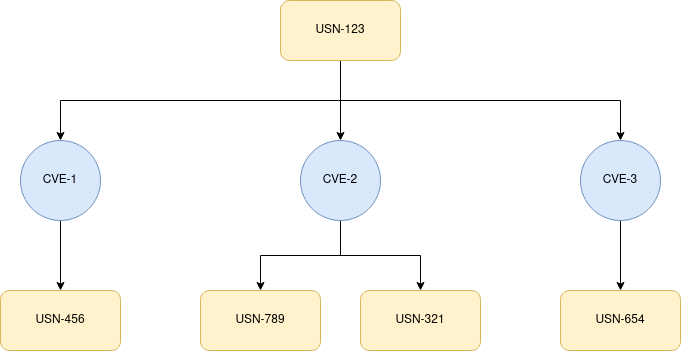

# CVEs and USNs explained

## What is a CVE

Common Vulnerabilities and Exposures (CVEs) are a way to catalogue and track public security
vulnerabilities for a given software. Every CVE is identified through a unique identifier,
for example [CVE-2023-0465](https://www.cve.org/CVERecord?id=CVE-2023-0465).

CVEs are maintained by the [MITRE Corporation](https://cve.mitre.org/) and the goal of the project
is to provide naming conventions for the public known security issues while also maintaining a
centralised repository for all of the security issues. This makes it easier for an organization to
submit a new security flaw though the CVE convention while also analysing any other existing CVEs
in the database.

You can search for any existing CVE related to Ubuntu using
[the Ubuntu CVE page](https://ubuntu.com/security/cves).

## What is a USN?

An Ubuntu Security Notice (USN) is the way that Canonical publicly catalogues and displays security
vulneratibilities for Ubuntu packages. Usually, a USN is composed of one or more
[CVEs](#what-is-a-cve) and it also contains update instructions to fix the issue, if a fix is
already available.

USNs follow a naming convention of the format: [USN-5963-1](https://ubuntu.com/security/notices/USN-5963-1)

You can search for any existing USN using
[the Ubuntu Security Notices page](https://ubuntu.com/security/notices).

## What are related USNs?

A USN is composed of different CVEs. If the same CVE appears on multiple USNs, we say that those USNs are related.
In the following image, we can see a visual representation of that concept, where USN-789 and USN-321
are related USNs because both are affected by CVE-2:

A real example can be seen in [USN-5573-1](https://ubuntu.com/security/notices/USN-5573-1).
In the section **Related notices**, it shows that both **USN-5570-1**
and **USN-5570-2** are related to **USN-5573-1**.

This information is useful for users that want to tackle
all related USNs at once, making sure that a CVE is fully fixed on their Ubuntu machine.
