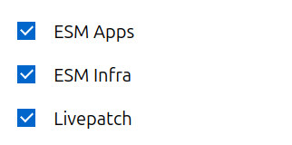

# How to get an Ubuntu Pro token and attach to a subscription

## Get an Ubuntu Pro token

Retrieve your Ubuntu Pro token from the
[Ubuntu Pro portal](https://ubuntu.com/pro/). Log in with your "Single
Sign On" credentials, the same credentials you use for https://login.ubuntu.com.

Being logged in you can then go to the
[Ubuntu Pro Dashboard](https://ubuntu.com/pro/dashboard) that is associated to
your user. It will show you all subscriptions currently available to you and
for each the associated token.

Note that even without buying anything you can always obtain a free personal
token that way, which provides you with access to several of the Ubuntu Pro
services.

## Attach to a subscription

Once that token is obtained, to attach your machine to a subscription, just run:

```
$ sudo pro attach YOUR_TOKEN
```

You should see output like the following, indicating that you have successfully
associated this machine with your account.

```
Enabling default service esm-infra
Updating package lists
ESM Infra enabled
This machine is now attached to 'Ubuntu Pro'

SERVICE       ENTITLED  STATUS    DESCRIPTION
esm-apps      yes       enabled   Expanded Security Maintenance for Applications
esm-infra     yes       enabled   Expanded Security Maintenance for Infrastructure
livepatch     yes       enabled   Canonical Livepatch service

NOTICES
Operation in progress: pro attach

Enable services with: pro enable <service>
```

Once the Ubuntu Pro Client is attached to your Ubuntu Pro account, you can use
it to activate various services, including: access to ESM packages, Livepatch,
FIPS, and CIS. Some features are specific to certain LTS releases.

## Control of auto-enabled services

Your subscription controls which services are available to you and which ones
you can manage via the [Ubuntu Pro Dashboard](https://ubuntu.com/pro/dashboard).

Recommended services are auto-enabled by default when attaching a system.
You can choose which of the available services will be automatically
enabled or disabled when you attach by toggling them in the
[Ubuntu Pro Dashboard](https://ubuntu.com/pro/dashboard). 
Available services can always be enabled or disabled on the command line
with `pro enable` and `pro disable` after attaching.



If your subscription does not permit you to change the default
enabled services via the Dashboard, or if you want to keep the
defaults but do not want to auto-enable any services while attaching a particular
machine, you can pass the `--no-auto-enable` flag to `attach` using the following command:

```
$ sudo pro attach YOUR_TOKEN --no-auto-enable
```
