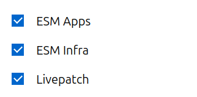

.. _attach:

How to attach a machine to your Ubuntu Pro subscription
*******************************************************

To attach your machine to a subscription, run the following command in your
terminal:

.. code-block:: bash

    $ sudo pro attach

You should see output like this, giving you a link and a code:

.. code-block:: bash

    ubuntu@test:~$ sudo pro attach
    Initiating attach operation...

    Please sign in to your Ubuntu Pro account at this link:
    https://ubuntu.com/pro/attach
    And provide the following code: H31JIV

Open the link without closing your terminal window. 

In the field that asks you to enter your code, copy and paste the code shown
in the terminal. Then, choose which subscription you want to attach to. 
By default, the Free Personal Token will be selected.

If you have a paid subscription and want to attach to a different token, you
may want to log in first so that your additional tokens will appear. 

Once you have pasted your code and chosen the subscription you want to attach
your machine to, click on the "Submit" button.

The attach process will then continue in the terminal window, and you should
eventually be presented with the following message:

.. code-block:: bash 

    Attaching the machine...
    Enabling default service esm-apps
    Updating Ubuntu Pro: ESM Apps package lists
    Ubuntu Pro: ESM Apps enabled
    Enabling default service esm-infra
    Updating Ubuntu Pro: ESM Infra package lists
    Ubuntu Pro: ESM Infra enabled
    Enabling default service livepatch
    Installing snapd snap
    Installing canonical-livepatch snap
    Canonical Livepatch enabled
    This machine is now attached to 'Ubuntu Pro - free personal subscription'

When the machine has successfully been attached, you will also see a summary of
which services are enabled and information about your subscription.

Once the Ubuntu Pro Client is attached to your Ubuntu Pro account, you can use
it to activate various services, including: access to ESM packages, Livepatch,
FIPS, and CIS. Some features are specific to certain LTS releases.

Control of auto-enabled services
================================

Your subscription controls which services are available to you and which ones
you can manage via the Ubuntu Pro Dashboard.

Recommended services are auto-enabled by default when attaching a machine.
You can choose which of the available services will be automatically
enabled or disabled when you attach by toggling them "on" or "off" in the
`Ubuntu Pro Dashboard <Pro_dashboard_>`_. 

Available services can always be enabled or disabled on the command line
with ``pro enable`` and ``pro disable`` after attaching.

If your subscription does not permit you to change the default enabled services
via the Dashboard, or if you want to keep the defaults but do not want to
auto-enable any services while attaching a particular machine, you can pass
the ``--no-auto-enable`` flag to ``attach`` in the following way:

.. code-block:: bash

    $ sudo pro attach --no-auto-enable

.. note::
   
   If you want to control which services are enabled during attach, you can
   :ref:`attach with a configuration file <attach-with-config>` instead.

.. LINKS

.. include:: ../links.txt
