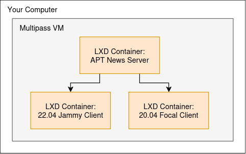

Host your own APT News
**********************

In this tutorial, you will learn how to host your own APT news and how to
configure your Ubuntu machines to use it.

APT news is used to display custom messages within the ``apt upgrade`` command,
and can be a good way of delivering messages that are related to APT updates
to users.

.. Why we use Multipass + command to install it
.. include:: ./common/install-multipass.txt

Tutorial Architecture
=====================

To demonstrate how APT news works, we will create three containers inside a
Multipass VM. We will configure one of them to be the APT news server, and we
will configure the other two to consume APT news from that server. It will
look something like this:

Command snippets throughout this tutorial will include a shell prompt to make
it clear on which machine the command will be executed.

.. list-table::
   :header-rows: 1

   * - Prompt
     - Machine
   * - ``you@yourcomputer:~$``
     - Your computer
   * - ``ubuntu@tutorial:~$``
     - Multipass VM named ``tutorial``
   * - ``root@apt-news-server:~#``
     - LXD container named ``apt-news-server``
   * - ``root@client-jammy:~#``
     - LXD container named ``client-jammy``
   * - ``root@client-focal:~#``
     - LXD container named ``client-focal``

Create the local VM and containers
==================================

Begin by launching an Ubuntu 24.04 Multipass VM with the following command:

.. code-block:: console

   you@yourcomputer:~$ multipass launch noble --disk 10G --name tutorial

Access the VM using the ``multipass shell`` subcommand.

.. code-block:: console

   you@yourcomputer:~$ multipass shell tutorial

When you see "Welcome to Ubuntu 24.04 LTS" and the shell prompt changes to the
following, you know that you've entered the VM.

.. code-block:: console

   ubuntu@tutorial:~$

Inside the VM, set up `LXD`_:

.. code-block:: console

   ubuntu@tutorial:~$ lxd init --minimal

Launch three containers inside the VM with the following commands. This may
take a while since it will need to download the appropriate Ubuntu images.

.. code-block:: console

   ubuntu@tutorial:~$ lxc launch ubuntu-daily:noble apt-news-server
   ubuntu@tutorial:~$ lxc launch ubuntu-daily:jammy client-jammy
   ubuntu@tutorial:~$ lxc launch ubuntu-daily:focal client-focal

Set up the APT news server
==========================

Now, let's setup the ``apt-news-server`` container to serve APT news content.
APT news content is formatted as a JSON file and served over HTTP(S). We can
accomplish this by installing and configuring `nginx`_ to serve a properly
formatted JSON file.

First, enter the ``apt-news-server`` container:

.. code-block:: console

   ubuntu@tutorial:~$ lxc shell apt-news-server
   root@apt-news-server:~#

In ``apt-news-server``, install ``nginx`` via ``apt``. This will also start the HTTP server on port 80.

.. code-block:: console

   root@apt-news-server:~# apt install -y nginx

With ``nginx`` installed and running, we can author an APT news JSON file. Open ``/var/www/html/aptnews.json``:

.. code-block:: console

   root@apt-news-server:~# nano /var/www/html/aptnews.json

and add the following content:

.. code-block:: json

   {
     "messages": [
       {
         "begin": "TODAY",
         "selectors": {
           "codenames": ["jammy"]
         },
         "lines": [
           "Hello 22.04 users!",
           "This is the APT news server."
         ]
       },
       {
         "begin": "TODAY",
         "lines": [
           "Hello everyone else!",
           "This is the APT news server."
         ]
       }
     ]
   }

In ``nano``, use CTRL-S and CTRL-X to save and exit, respectively.

That apt news configuration will show one message to systems running Ubuntu
22.04 (Codename "jammy") and will show another message to all other systems.

The value of ``"begin"`` actually needs to be an ISO8601 formatted datetime
string, and the message won't be shown before the ``begin`` date or more than 30
days after the ``begin`` date. For the purposes of this tutorial you can
quickly replace "TODAY" with today's date in ``aptnews.json`` with the
following command.

.. code-block:: console

   root@apt-news-server:~# sed -i "s/TODAY/$(date --iso-8601=seconds)/" /var/www/html/aptnews.json

You can double check that the command worked by verifying the ``begin`` field has an appropriate value.

.. code-block:: console
   :emphasize-lines: 5

   root@apt-news-server:~# cat /var/www/html/aptnews.json
   {
     "messages": [
       {
         "begin": "2024-07-30T16:35:19+00:00",
         "selectors": {
           "codenames": ["jammy"]
   ...

We're done configuring ``apt-news-server`` for now, so you can exit that container

.. code-block:: console

   root@apt-news-server:~# exit
   ubuntu@tutorial:~$

Configure the client machines to use the APT news server
========================================================

We need to configure both client machines to use the APT news server we just
created. This is a single command on each container that we can run using
``lxc exec``:

.. code-block:: console

   ubuntu@tutorial:~$ lxc exec client-jammy -- pro config set apt_news_url=http://apt-news-server/aptnews.json
   ubuntu@tutorial:~$ lxc exec client-focal -- pro config set apt_news_url=http://apt-news-server/aptnews.json

That's it! Now those containers will start displaying APT news in the output of ``apt upgrade``.

Normally, the containers would fetch the latest APT news whenever an
``apt update`` is run, but at most once per day. For this tutorial, we'll use
``pro refresh messages`` to force the containers to fetch the latest news
right away.

In the Jammy container we expect to see the special message for systems on
Ubuntu 22.04.

First enter the Jammy container.

.. code-block:: console

   ubuntu@tutorial:~$ lxc shell client-jammy

Then run these commands to see the APT news.

.. code-block:: console

   root@client-jammy:~# pro refresh messages
   root@client-jammy:~# apt upgrade

The output of ``apt upgrade`` should look like this.

.. code-block:: console

   Reading package lists... Done
   Building dependency tree... Done
   Reading state information... Done
   Calculating upgrade... Done
   #
   # Hello 22.04 users!
   # This is the APT news server.
   #
   0 upgraded, 0 newly installed, 0 to remove and 0 not upgraded.

Now you can exit the container.

.. code-block:: console

   root@client-jammy:~# exit
   ubuntu@tutorial:~$

And in the Focal container we expect to see the other message.

Enter the Focal container.

.. code-block:: console

   ubuntu@tutorial:~$ lxc shell client-focal

Then run these commands to see the APT news.

.. code-block:: console

   root@client-focal:~# pro refresh messages
   root@client-focal:~# apt upgrade

The output of ``apt upgrade`` should look like this.

.. code-block:: console

   Reading package lists... Done
   Building dependency tree... Done
   Reading state information... Done
   Calculating upgrade... Done
   #
   # Hello everyone else!
   # This is the APT news server.
   #
   0 upgraded, 0 newly installed, 0 to remove and 0 not upgraded.

Now you can exit the container.

.. code-block:: console

   root@client-focal:~# exit
   ubuntu@tutorial:~$

Clean up
========

Congratulations! This tutorial demonstrated the basics of how an APT news server can be set up and used by other Ubuntu machines.

Now that the tutorial is over, you can exit out of the Multipass VM and delete it.

.. code-block:: console

   ubuntu@tutorial:~$ exit
   you@yourcomputer:~$ multipass delete --purge tutorial

.. LINKS
.. include:: ../links.txt

.. _Multipass: https://multipass.run/
.. _LXD: https://documentation.ubuntu.com/lxd/
.. _nginx: https://nginx.org/
